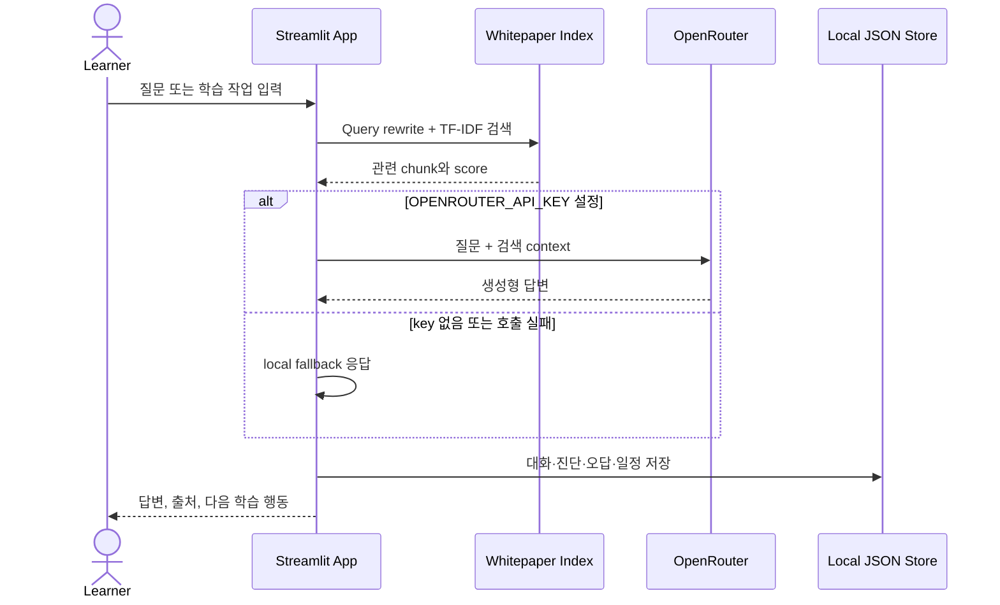

# AIVLE 학습도우미

> 백서 검색, 질문, 예습·진단, 복습, 취업 준비와 일정을 하나의 Streamlit 흐름으로 연결한 학습 보조 MVP

`data/aivle_kt_learning_whitepaper_2026.docx`를 기본 학습 자료로 사용합니다. 문서를 TF-IDF로 검색하고, OpenRouter API가 설정된 경우 검색 context를 이용해 답변을 생성합니다. API key가 없거나 호출이 실패하면 local 검색과 규칙 기반 응답으로 전환됩니다.

| 상태 | UI | 검색 | 생성형 답변 | 기록 저장 |
|---|---|---|---|---|
| Prototype | Streamlit | TF-IDF + cosine similarity | OpenRouter optional | Local JSON |

## 하나의 학습 흐름

| 단계 | 기능 | 저장 결과 |
|---|---|---|
| 질문 | 백서 기반 검색과 답변 | 대화와 검색 출처 |
| 예습 | 주차·주제·시간 기반 자료 생성 | 예습 내용 |
| 진단 | 객관식 quiz 생성과 채점 | 점수·취약 주제 |
| 복습 | 누적 결과와 오답 분석 | 오답노트 |
| 취업 준비 | 포트폴리오·공고·면접 자료 분석 | career report |
| 일정 | 커리큘럼·학습 계획·마감일 통합 | calendar event |

## 주요 기능

### 백서 기반 질의

- DOCX/PDF/TXT 문서 parsing
- chunk 단위 TF-IDF index
- cosine similarity 검색
- 복합 질문의 Query Rewriting, Multi Query, Sub Query 분해
- 검색 결과를 context로 구성한 OpenRouter 답변
- 검색 근거 표시와 API 실패 fallback

### 예습·진단·복습

- 주제별 예습 자료와 5문항 quiz 생성
- 객관식 채점, 학습 수준 판별, 취약 주제 계산
- 진단 결과와 오답노트 누적
- 결과 추이와 학습 coach feedback

### 취업 준비와 일정

- 포트폴리오·채용공고·공모전·면접 자료 분석
- 자기소개서 또는 README 문장 정리
- 공고 마감일을 calendar에 추가
- `streamlit-calendar`와 HTML fallback calendar
- 커리큘럼, 개인 일정, 진단, career record 통합 조회

## 처리 흐름



검색 index는 현재 백서 파일의 경로·수정 시각·크기를 기준으로 cache됩니다. 업로드한 백서는 `data/whitepaper/current_whitepaper.*`로 관리됩니다.

## 로컬 실행

요구 사항: Python 3.10 이상 권장

```powershell
python -m pip install -r requirements.txt
python -m streamlit run app.py
```

API key 없이도 로그인, local 문서 검색, fallback quiz와 일정 기능을 확인할 수 있습니다. 생성형 답변에는 OpenRouter 설정이 필요합니다.

## 설정

Streamlit 배포에서는 `.streamlit/secrets.toml`, 로컬에서는 OS 환경변수를 사용할 수 있습니다.

```toml
OPENROUTER_API_KEY = "your_openrouter_api_key"
APP_LOGIN_ID = "admin"
APP_LOGIN_PASSWORD = "change-this-password"
APP_LOGIN_SECRET = "separate-token-signing-secret"
```

| 변수 | 기본 동작 |
|---|---|
| `OPENROUTER_API_KEY` | 미설정 시 local fallback |
| `APP_LOGIN_ID` | 기본값 `admin` |
| `APP_LOGIN_PASSWORD` | 기본값 `aivle2026` |
| `APP_LOGIN_SECRET` | 미설정 시 login password를 HMAC secret으로 사용 |

현재 OpenRouter model은 `app.py`의 `DEFAULT_OPENROUTER_MODEL` 상수로 선택됩니다. 환경변수로 model을 변경하는 구조는 구현되어 있지 않습니다.

## 데이터와 저장

| 위치 | 내용 | Git 관리 |
|---|---|---|
| `data/aivle_kt_learning_whitepaper_2026.docx` | bundled 기본 백서 | 포함 |
| `data/whitepaper/` | 실행 중 업로드한 현재 백서 | 제외 |
| `storage/conversations.json` | 대화 기록 | 제외 |
| `storage/study_results.json` | 진단 결과 | 제외 |
| `storage/wrong_notes.json` | 오답노트 | 제외 |
| `storage/calendar_events.json` | 개인 일정 | 제외 |
| `storage/daily_checklist.json` | 학습 checklist | 제외 |
| `storage/career_reports.json` | 취업 준비 결과 | 제외 |

저장 방식은 사용자별 database가 아닌 단일 실행 환경의 local JSON입니다.

## 기술 구성

| 영역 | 기술 | 사용 목적 |
|---|---|---|
| UI | Streamlit | 단일 앱과 menu routing |
| Document | `python-docx`, `pypdf` | 백서·업로드 파일 parsing |
| Search | scikit-learn | TF-IDF와 cosine similarity |
| Data | pandas, openpyxl | 기록·표·업로드 자료 처리 |
| Chart | Altair | 진단 결과 시각화 |
| Calendar | `streamlit-calendar` | 일정 UI |
| LLM | OpenRouter REST API | 검색 context 기반 생성 |
| Storage | JSON files | local 학습 기록 |

## 저장소 구조

```text
.
├── app.py                              # UI, 검색, LLM, 기록 처리
├── data/
│   └── aivle_kt_learning_whitepaper_2026.docx
├── .streamlit/
│   └── config.toml
├── .devcontainer/
│   └── devcontainer.json
├── requirements.txt
└── README.md
```

## 보안과 현재 한계

- 기본 ID/password는 데모 값이므로 배포 전에 반드시 변경해야 합니다.
- 로그인 유지 token은 URL query parameter에 ID와 HMAC signature를 담으며 만료시간이 없습니다. 운영용 인증 체계가 아닙니다.
- 업로드 문서와 학습 기록은 local filesystem에 저장되며 사용자별 격리가 없습니다.
- OpenRouter 호출 결과는 model availability와 rate limit의 영향을 받습니다.
- TF-IDF 검색은 embedding/vector database 기반 의미 검색보다 표현 변화에 취약합니다.
- 공식 KT AIVLE School 안내와 최신 curriculum을 대체하지 않습니다.

운영 서비스로 확장하려면 사용자 인증, database persistence, token 만료·회전, 파일 접근 통제, vector retrieval을 우선 보강해야 합니다.
