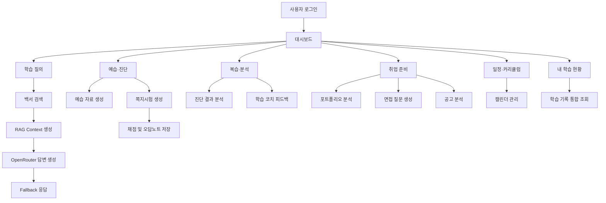

# AIVLE 학습도우미

AI-powered learning assistant for KT AIVLE School learners.

KT AIVLE School 학습자가 과정 정보, 커리큘럼, 백서 자료, 학습 질문, 예습·진단, 복습, 취업 준비, 일정 관리를 한 화면에서 사용할 수 있도록 만든 Streamlit 기반 학습 보조 앱입니다.

이 프로젝트는 흩어진 학습 자료와 개인 학습 기록을 하나의 흐름으로 연결하는 것을 목표로 하는 MVP입니다.

## 1. 프로젝트 소개

`AIVLE 학습도우미`는 KT AIVLE School 학습 과정에서 필요한 질문, 예습, 진단, 복습, 취업 준비, 일정 관리를 Streamlit 앱 안에서 다루도록 구성한 프로토타입입니다.

기본 백서 문서(`data/aivle_kt_learning_whitepaper_2026.docx`)를 기반으로 학습자가 질문을 입력하면 관련 문서를 검색하고, OpenRouter API를 사용할 수 있는 경우 LLM 답변을 생성합니다. API key가 없거나 호출에 실패해도 앱 전체가 중단되지 않도록 fallback 검색/응답 흐름을 포함했습니다.

## 2. 문제 정의

다음 문제를 해결하려 했습니다.

- 커리큘럼, 공지, 백서, 개인 학습 기록이 분산되어 있음
- 학습자가 필요한 정보를 매번 직접 찾아야 함
- 예습, 복습, 진단, 오답 정리가 분리되어 학습 흐름이 끊김
- 포트폴리오, 면접, 채용공고 분석 등 취업 준비 과정이 별도로 관리됨
- 학습 일정과 개인 계획을 함께 확인하기 어려움

## 3. 핵심 기능

### 학습 질의

- 백서 기반 질문 응답
- 추천 질문 버튼 제공
- RAG 기반 문서 검색
- Query Rewriting, Multi Query, Sub Query 분해 적용
- OpenRouter API 기반 답변 생성
- API key가 없을 때도 fallback 검색/응답 흐름 유지

### 예습·진단

- 주차와 주제 기반 예습 자료 생성
- 쪽지시험 생성
- 객관식 문제 채점
- 점수 기반 학습 수준 판별
- 오답노트 저장

### 복습·분석

- 진단 결과 누적 관리
- 점수 추이 확인
- 취약 주제 분석
- 오답노트 필터링
- AI 학습 코치 피드백 생성

### 취업 준비

- 포트폴리오 파일 분석
- 면접 예상 질문 생성
- 채용공고/공모전 공고 분석
- 자기소개서 또는 README 문장 정리
- 마감일 캘린더 추가

### 일정·커리큘럼

- AIVLE 커리큘럼 달력 제공
- 개인 학습 계획 생성
- 일정 추가/삭제
- 월간 캘린더 UI 제공
- `streamlit-calendar` 실패 시 HTML 캘린더 fallback 제공

### 내 학습 현황

- 최근 진단 기록 확인
- 학습 현황 캘린더 확인
- 최근 취업 준비 기록 확인
- 백서 업로드 및 현재 학습 자료 확인

## 4. 내가 구현한 내용

- Streamlit 기반 단일 페이지 앱 구조 설계
- 사이드바 기반 메뉴 라우팅 구현
- 로그인 및 세션 유지 흐름 구현
- HMAC query token 기반 자동 인증 처리
- DOCX/PDF/TXT 문서 파싱
- TF-IDF + cosine similarity 기반 백서 검색
- RAG 검색 흐름 구성
- Query Rewriting / Multi Query / Sub Query 분해 로직 구성
- OpenRouter API 연동
- API 실패 시 fallback 답변 구조 구현
- 예습 자료 생성 및 쪽지시험 생성
- 학습 결과 저장, 오답노트 저장
- 일정, 체크리스트, 커리어 분석 기록 저장
- 캘린더 UI 및 fallback 달력 구현
- 포트폴리오/면접/공고 분석 화면 구현
- Dev Container 기반 실행 환경 구성

## 5. 시스템 구조



## 6. 기술 스택

- Python
- Streamlit
- pandas
- scikit-learn
- TF-IDF
- cosine similarity
- python-docx
- pypdf
- requests
- OpenRouter API
- Altair
- streamlit-calendar
- Dev Container

## 7. 프로젝트 구조

```text
.
├── app.py
├── README.md
├── requirements.txt
├── .gitignore
├── .streamlit/
│   └── config.toml
├── .devcontainer/
│   └── devcontainer.json
└── data/
    └── aivle_kt_learning_whitepaper_2026.docx
```

앱 실행 중에는 아래 폴더와 JSON 파일이 생성될 수 있습니다. `storage/`는 사용자 실행 데이터이므로 git에 올리지 않습니다.

```text
storage/
├── uploads/
├── conversations.json
├── study_results.json
├── wrong_notes.json
├── calendar_events.json
├── daily_checklist.json
└── career_reports.json
```

업로드한 백서 파일은 `data/whitepaper/` 아래에 저장될 수 있으며, 이 폴더도 실행 중 생성 데이터로 관리합니다.

## 8. 실행 방법

### 1) 설치

```bash
pip install -r requirements.txt
```

### 2) 실행

```bash
streamlit run app.py
```

### 3) 환경변수 또는 Streamlit Secrets 설정

`.streamlit/secrets.toml` 예시는 아래와 같습니다. 실제 API key는 README나 git에 올리지 않습니다.

```toml
OPENROUTER_API_KEY = "your_openrouter_api_key"
APP_LOGIN_ID = "admin"
APP_LOGIN_PASSWORD = "change-this-password"
```

기본 로그인 정보는 데모 실행을 위한 값이며, 배포 환경에서는 반드시 변경해야 합니다. API key가 없어도 일부 fallback 검색/응답 기능은 동작하지만, 생성형 답변 품질은 제한됩니다.

## 9. 사용 흐름

1. 로그인
2. 대시보드에서 오늘의 학습 체크리스트 확인
3. 학습 질의에서 백서 기반 질문
4. 예습·진단에서 주차별 예습 자료 생성
5. 쪽지시험 풀이 후 오답노트 저장
6. 복습·분석에서 취약 주제 확인
7. 취업 준비 메뉴에서 포트폴리오/면접/공고 분석
8. 일정·커리큘럼에서 학습 일정 관리
9. 내 학습 현황에서 누적 기록 확인

## 10. 주요 구현 포인트

### RAG 검색 개선

- 백서 텍스트를 chunk 단위로 분리
- TF-IDF 벡터화
- cosine similarity 기반 검색
- 복합 질문일 경우 Query Rewriting, Multi Query, Sub Query 사용
- 검색 결과를 context로 구성해 LLM 답변에 활용

### Fallback 설계

- OpenRouter API key가 없거나 호출이 실패해도 앱 전체가 중단되지 않도록 설계
- 로컬 검색 결과와 규칙 기반 응답을 사용해 최소 응답 제공

### 학습 기록 저장

- 대화 기록
- 진단 결과
- 오답노트
- 캘린더 일정
- 체크리스트
- 취업 준비 기록

### 캘린더 UI

- `streamlit-calendar` 사용
- 라이브러리 로드 실패 시 HTML 달력 fallback
- 커리큘럼 일정, 개인 일정, 진단 결과, 취업 준비 마감일을 통합 표시

## 11. 보안 및 개인정보 처리

- API key는 환경변수 또는 Streamlit secrets로 관리합니다.
- `.streamlit/secrets.toml`은 git에 올리지 않습니다.
- 실행 중 생성되는 `storage/` 폴더는 git에 올리지 않습니다.
- 사용자가 업로드한 파일은 로컬 실행 환경 기준으로 처리합니다.
- 공개 repo에는 실제 개인 API key를 포함하지 않습니다.
- 기본 로그인 정보는 배포 환경에서 반드시 변경해야 합니다.

## 12. 한계

- 공식 KT AIVLE School 안내를 대체하지 않습니다.
- 백서 내용은 기수별로 달라질 수 있습니다.
- OpenRouter API 응답은 모델 상태와 API 사용 가능 여부에 영향을 받습니다.
- 문서 검색은 TF-IDF 기반이므로 의미 검색 전용 벡터 DB보다 한계가 있습니다.
- 사용자가 업로드한 문서 품질에 따라 분석 결과가 달라질 수 있습니다.
- Streamlit 로컬 앱 기준으로 설계되어 운영 배포 전 인증/보안 보강이 필요합니다.

## 13. 개선 방향

- 벡터 DB 기반 검색으로 전환
- 사용자별 계정/권한 관리
- DB 기반 학습 기록 저장
- 배포 환경용 인증 강화
- 검색 결과 근거 표시 고도화
- 학습 리포트 PDF 내보내기
- 취업 준비 결과 자동 요약
- 커리큘럼 최신화 자동화

## 14. 포트폴리오 요약

- 문제: AIVLE 학습 자료, 진단, 복습, 취업 준비, 일정이 분산되어 있음
- 접근: 백서 기반 RAG 검색과 학습 기록 저장 흐름을 Streamlit 앱으로 통합
- 구현: 문서 파싱, 검색, LLM 연동, 진단, 오답노트, 캘린더, 취업 준비 기능 구현
- 결과물: 학습자가 질문 → 예습 → 진단 → 복습 → 취업 준비까지 한 화면에서 관리할 수 있는 MVP
- 확장성: 벡터 DB, 사용자 인증, DB 저장소, 배포 환경 보강을 통해 서비스형 구조로 확장 가능

